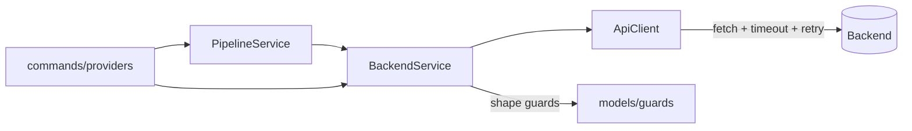
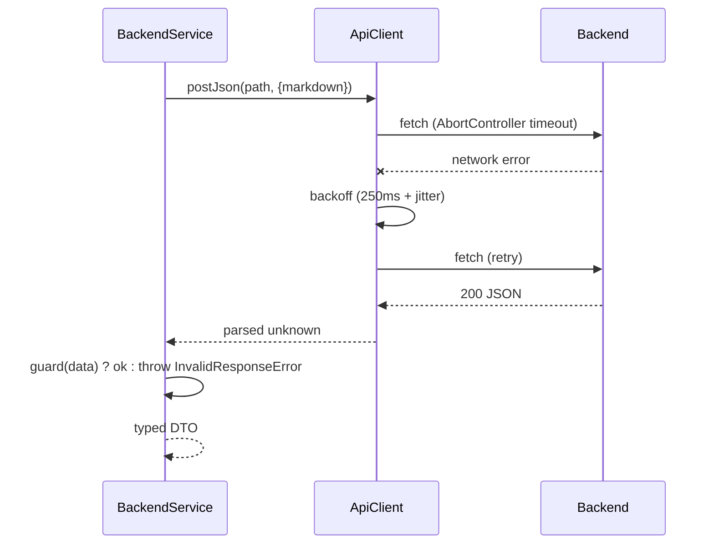

# API Communication

## Purpose
How the extension talks to the FastAPI backend: transport, error handling,
deserialization, and pipeline orchestration.

## Architecture Diagram

## Layers
- **`ApiClient` (transport, pure):** builds the URL (base resolved per request for live settings), enforces a timeout via `AbortController`, retries **only** transient failures (offline/timeout/5xx) with exponential backoff + jitter, and maps raw failures to typed errors. Never `vscode`, never UI.
- **`BackendService` (facade):** one method per endpoint (`parse`, `businessRules`, `risks`, `coverage`, `generate`, `playwright`, `health`); runs a **runtime shape guard** on every response (the deserialize boundary). `health()` returns a boolean (offline → `false`, not throw).
- **`PipelineService` (orchestration):** sequences `parse → business-rules → risks → coverage → generate`, emits a `ProgressEvent` per step, degrades on optional-step failure, and treats the `/generate` result as authoritative.

## Error hierarchy (`api/errors.ts`)
| Error | Cause | Retried? |
|-------|-------|----------|
| `OfflineError` | connection refused | ✅ |
| `TimeoutError` | aborted after timeout | ✅ |
| `ServerError` | 5xx | ✅ |
| `ValidationError` | 4xx | ❌ |
| `InvalidResponseError` | bad/unguarded shape | ❌ |

## Sequence Diagram — one guarded call with retry

## Endpoints (`api/endpoints.ts`)
`POST /requirements/{parse,business-rules,risks,coverage,generate}` · `POST /tests/playwright` · `POST /retrieval/search` · `GET /health`.

## Known trade-off — sequential recompute
Each individual endpoint independently re-parses (and `/coverage` re-extracts
rules), and `/generate` re-runs the whole pipeline. One analyze ≈ many seconds +
repeated LLM work, and preview rules/risks may differ from `/generate`'s. The
chosen mitigation: render preview from steps 1–5, then **override** with the
authoritative `/generate` result. The long-term fix is a `/generate/stream` SSE
endpoint emitting the same `ProgressEvent`s from one run.

## VS Code APIs used
None in `api/`/`BackendService`/`PipelineService` — that's the point (testable in plain Node).

## Common Mistakes
- No timeout → a hung backend hangs the UI forever.
- Retrying 4xx → wasted calls; only transient failures should retry.
- Trusting `response.json() as T` → silent `undefined` on drift. Guard it.
- No `clearTimeout` on success → leaked abort timer.

## Best Practices
- Inject `fetch`/`sleep` for deterministic, network-free tests.
- Validate at the boundary, trust within.
- One policy method (`isRetryable`) instead of scattered conditionals.

## Future Improvements
- SSE streaming for true live progress + single-run consistency.
- Request cancellation wired to a webview "Stop" button.

## Interview Talking Points
- The `AbortController` timeout pattern is the canonical bounded-fetch idiom.
- Runtime guards turn backend contract drift into a loud, specific error.
- The whole layer is `vscode`-free, so it's unit-tested *and* runs headless against the real backend.
