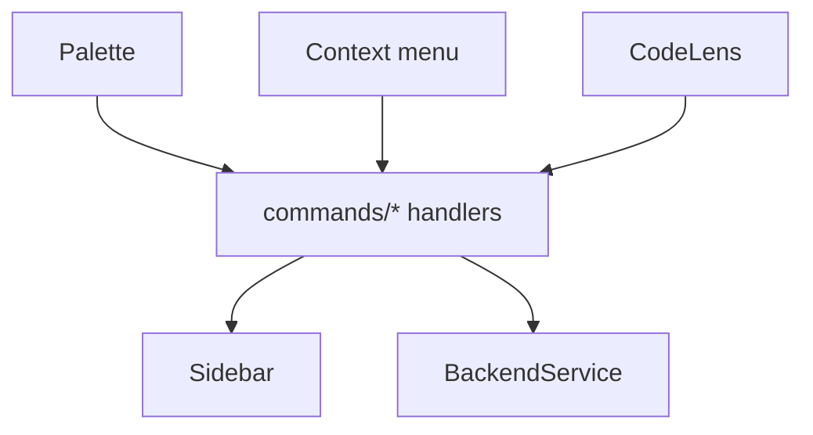
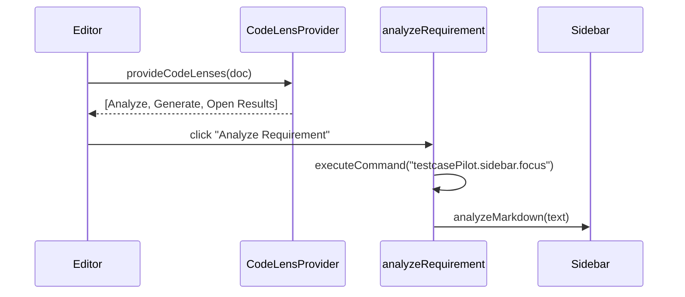

# Commands, Menus & CodeLens

## Purpose
Every way the user triggers TestCasePilot, and how those entry points are
registered and routed to a single set of handlers.

## Entry points
| Surface | Action(s) |
|---------|-----------|
| Command Palette | Analyze Requirement · Generate Test Cases · Open Sidebar · Check Backend Status · New Requirement (Form) |
| Editor right-click (`md`/`txt`) | Generate Test Cases · Analyze Requirement |
| CodeLens (requirement files) | Analyze Requirement · Generate Tests · Open Results |
| Editor title (markdown) | New Requirement (Form) — 🧪 |
| Status bar | click → Check Backend Status |

## Architecture Diagram

## Registration
A command is two halves that must agree:
- **Declared** in `package.json → contributes.commands` (palette title).
- **Registered** in `commands/index.ts` via `vscode.commands.registerCommand(id, handler)`.

IDs live once in `config/constants.ts` (`COMMANDS`) so package.json and code can't drift.

## Sequence Diagram — CodeLens → analyze

## Responsibilities
- **`commands/*`:** thin glue — read input, route to a service/sidebar, show a message.
- **`RequirementCodeLensProvider`:** returns 3 lenses at line 0, only when the doc has an H1 (gated to `markdown`/`plaintext` at registration).
- **`commands/index.ts`:** central registration; one line per command.

## VS Code APIs used
`commands.registerCommand`, `commands.executeCommand`, `languages.registerCodeLensProvider`, `CodeLens`, menu `when` clauses (`editorLangId`, `resourceLangId`), `window.withProgress`, notifications.

## Common Mistakes
- ID mismatch between package.json and code → "command not found".
- `editorLangId` vs `resourceLangId` confusion (editor vs explorer menus).
- CodeLens on every file → noise (gate by language + heuristic).
- Greedy `activationEvents` → slow startup (rely on contribution auto-activation).

## Best Practices
- One handler, many entry points (no duplicated flow).
- Centralized IDs; declarative `when` gating.
- Reveal the view (`<viewId>.focus`) before driving it.

## Future Improvements
- A dedicated "Generate QA Test Cases" context-menu label distinct from the palette title.
- Quick-pick to choose provider/scope before running.

## Interview Talking Points
- Progressive disclosure: palette for power users, CodeLens/right-click for discovery.
- `<viewId>.focus` is auto-generated for every contributed view.
- Declarative `when` clauses replace imperative visibility logic.
