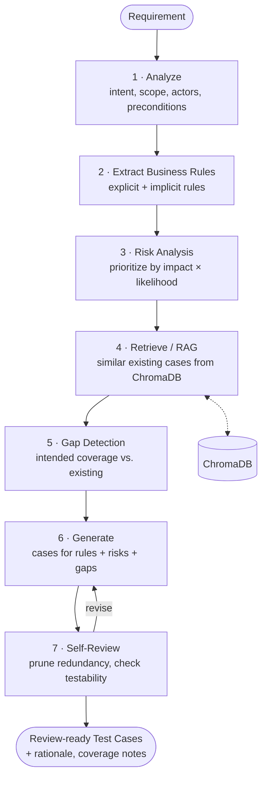

# Agent Pipeline Diagram

The multi-step reasoning pipeline the orchestrator runs for each requirement. Each step
feeds the next; the self-review step can loop back to revise before output. See
[ADR-0004](../adr/0004-agent-orchestration-pipeline.md).

### Step responsibilities

| Step | Output | Notes |
| --- | --- | --- |
| Analyze | Intent, scope, actors, preconditions | Cacheable per requirement |
| Extract rules | Business rules to enforce | Explicit + implicit |
| Risk analysis | Prioritized risk areas | Impact × likelihood |
| Retrieve (RAG) | Similar existing cases | Queries ChromaDB |
| Gap detection | Missing-coverage list | Intended vs. existing |
| Generate | Draft test cases | Targets rules / risks / gaps |
| Self-review | Final cases | First-class critique + revise |
