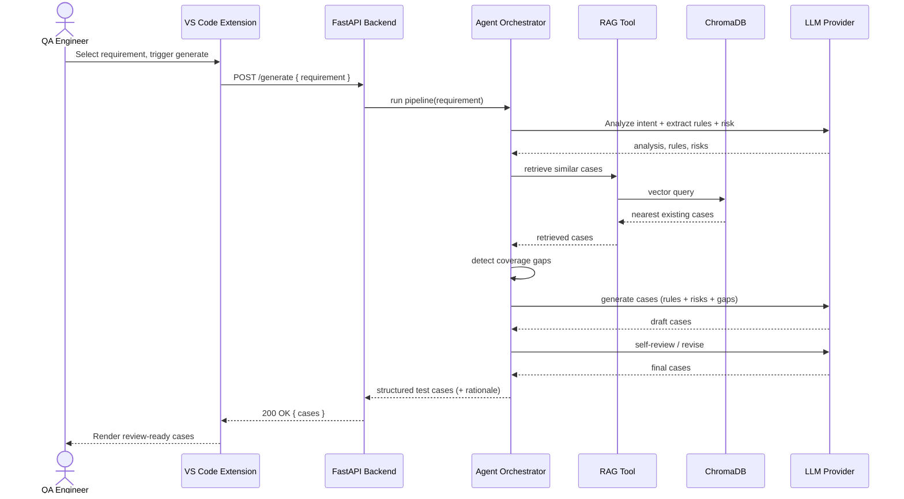

# Request Sequence Diagram

End-to-end sequence for a single test-case generation request, from the engineer's action
in VS Code through the backend pipeline and back.

> The number of LLM calls per request is intentional (see
> [ADR-0004](../adr/0004-agent-orchestration-pipeline.md)); analysis is cacheable and steps
> may be toggled to manage latency and cost.
