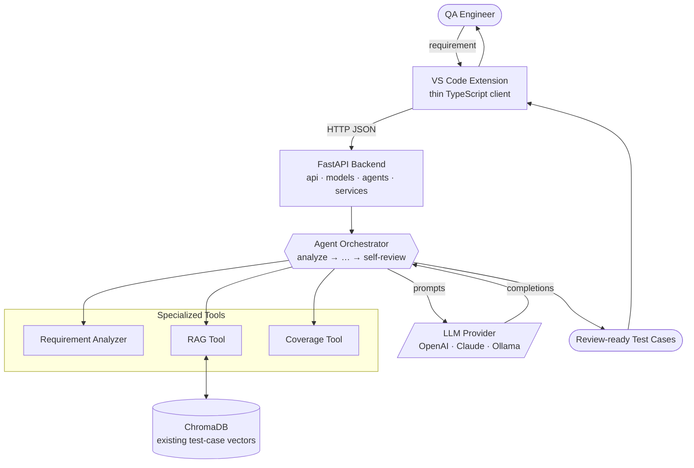

# System Context Diagram

High-level view of TestCasePilot: how a request flows from the user through the editor
extension into the backend, across the orchestrated tools, to the LLM provider, and back
as review-ready test cases.

> Pluggable provider selection is driven by environment variables — see
> [ADR-0002](../adr/0002-pluggable-llm-provider.md). RAG store rationale in
> [ADR-0003](../adr/0003-rag-with-chromadb.md).
