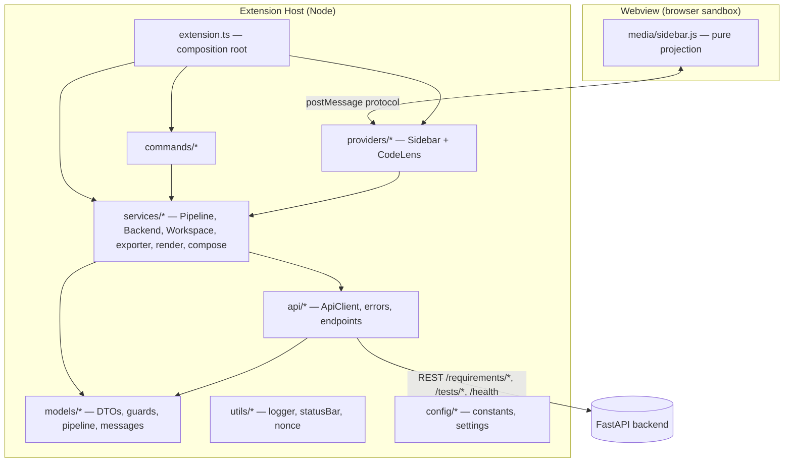
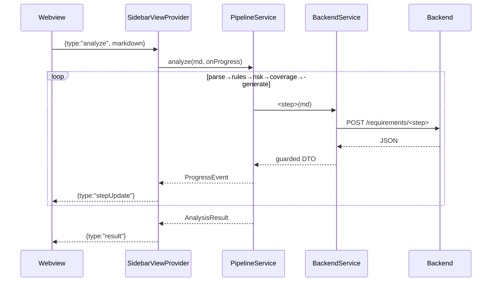

# Extension Architecture

## Purpose
How the TestCasePilot VS Code extension is structured and *why*. It is a **thin
client**: all AI/LLM logic lives in the FastAPI backend; the extension only
handles user interaction, workspace I/O, REST calls, and result display.

## Architecture Diagram

## Layered structure & dependency direction
Dependencies point **inward** toward the most stable, dependency-free code.

| Folder | Responsibility | Imports `vscode`? |
|--------|----------------|-------------------|
| `models/` | DTO interfaces, runtime guards, pipeline + message types | No |
| `api/` | HTTP transport: timeout, retry, typed errors | No |
| `services/` | Orchestration + pure formatting (Pipeline, Backend, exporter, render, compose) | Mostly no¹ |
| `config/` | Constants + typed settings readers | settings only |
| `utils/` | Logger, status bar, nonce | Yes |
| `providers/` | VS Code providers (WebviewView, CodeLens) | Yes |
| `views/` | Webview HTML assembly | Yes |
| `commands/` | Command handlers (thin glue) | Yes |
| `extension.ts` | Composition root: construct + wire + register | Yes |

¹ `PipelineService`, `exporter`, `render`, `compose` are `vscode`-free (hence unit-tested in plain Node). `BackendService` is too; `WorkspaceService` is the I/O exception.

> **Naming note:** `providers/` means *VS Code extensibility providers*
> (`WebviewViewProvider`, `CodeLensProvider`) — unrelated to the backend *LLM
> providers* (Ollama/Claude/OpenAI), which the thin client must never know about.

## Sequence Diagram — analyze flow

## Build (two-track)
- **esbuild** bundles `src/extension.ts` → `dist/extension.js` (`platform:node`, `format:cjs`, `external:["vscode"]`). Fast, single file, *no type-checking*.
- **tsc** does `--noEmit` type-checking and compiles the pure modules + tests to `out/` for `node --test`.
- Webview assets (`media/*`) are shipped as-is — never bundled (they run in the browser).

## VS Code APIs used
`ExtensionContext.subscriptions`, `commands.registerCommand`, `window.registerWebviewViewProvider`, `languages.registerCodeLensProvider`, `workspace.getConfiguration`, `workspace.onDidChangeConfiguration`, `workspace.onDidSaveTextDocument`.

## Common Mistakes
- Bundling the `vscode` module (must be `external`).
- Letting esbuild be the only check (no type safety) — keep `tsc --noEmit`.
- Importing `vscode` into pure modules, breaking headless tests.
- A fat `extension.ts` with feature logic instead of pure wiring.

## Best Practices
- Composition root: construct collaborators once, inject everywhere.
- Dependency inversion toward `models/` (pure types) so the core is testable.
- Disposal discipline: everything created is pushed to `context.subscriptions`.

## Future Improvements
- Replace sequential pipeline calls with a single `/generate/stream` SSE endpoint.
- A small DI container if the dependency graph grows.
- `@vscode/test-electron` integration tests for the provider/commands.

## Interview Talking Points
- "Thin client by construction" — the CSP forbids the webview from reaching the network; all logic is host-side.
- Two-track build buys esbuild speed *and* tsc safety.
- Dependency direction (inward to pure types) is what makes most of the codebase unit-testable without an editor.
