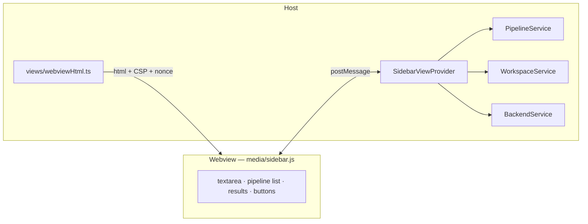
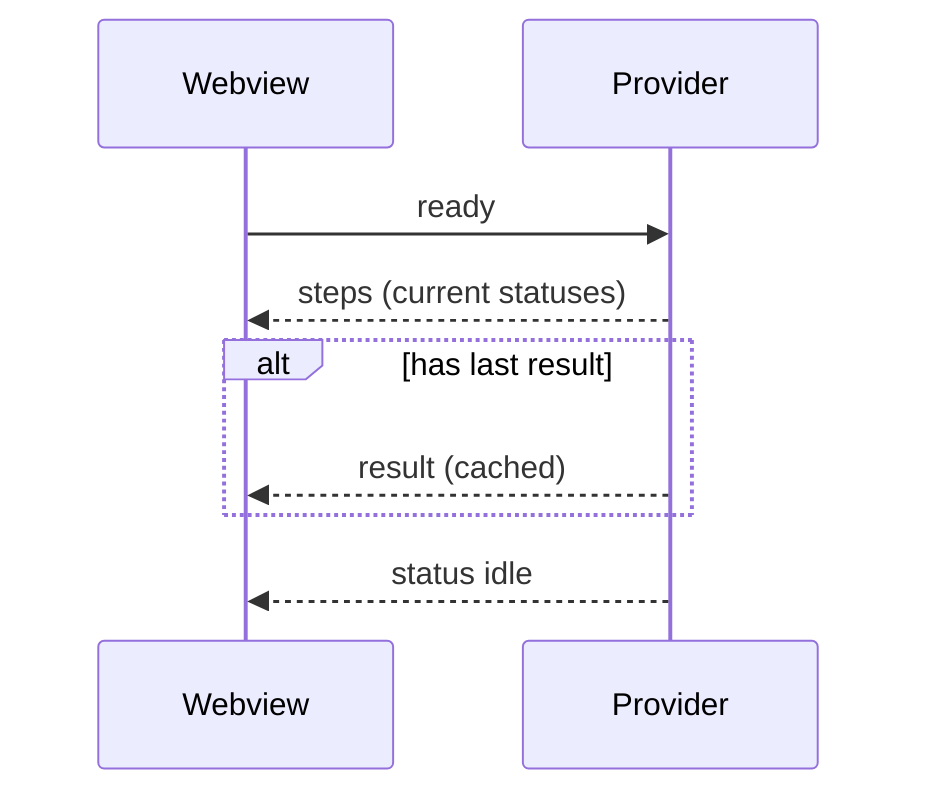

# Sidebar (WebviewView)

## Purpose
The Copilot-style panel in the Activity Bar: compose a requirement, watch the
7-step agent pipeline run live, see results, and export artifacts.

## Architecture Diagram

## Message protocol (`models/messages.ts`)
Typed discriminated unions, both directions.

| Webview → Host | Host → Webview |
|----------------|----------------|
| `ready` | `steps` (full list) |
| `analyze {markdown}` | `stepUpdate {step,status,durationMs}` |
| `generate {markdown}` | `result {AnalysisResult}` |
| `generatePlaywright` | `status {state}` |
| `export {format}` | `error {message}` |
| `useActiveEditor` | `log {text}` · `setMarkdown {markdown}` |

## Sequence Diagram — boot + hydrate

## Responsibilities
- **Provider (host):** single source of truth — owns step statuses + `lastResult`; runs the pipeline; bridges `ProgressEvent`→`stepUpdate`; re-hydrates on `ready`; guards against concurrent runs (`busy`).
- **Webview (browser):** pure projection — emits intents, renders posted state, persists the textarea draft via `getState/setState`. No logic, no network.

## VS Code APIs used
`window.registerWebviewViewProvider`, `WebviewView.webview.{html,options,onDidReceiveMessage,postMessage}`, `Webview.asWebviewUri`, `Webview.cspSource`, `retainContextWhenHidden`.

## Security (CSP)
`default-src 'none'; script-src 'nonce-<nonce>'; style-src ${cspSource}` +
`localResourceRoots: [media/]`. The webview **cannot** reach the backend; all
network is host-side. All model-derived strings are escaped before `innerHTML`.

## Common Mistakes
- Keeping state only in the webview → blank panel after a redraw. Host owns it.
- No `localResourceRoots` → `asWebviewUri` assets fail to load.
- Missing/loose nonce → injected scripts run.
- Hardcoding the step list in the webview → drifts from `PIPELINE_STEPS`.

## Best Practices
- Host = source of truth; webview = projection.
- `retainContextWhenHidden` + host-side hydration = durable UI.
- Theme tokens for automatic theming.

## Future Improvements
- Author the webview script in TS (second esbuild `platform:browser` entry).
- Stream steps from one SSE call instead of sequential posts.

## Interview Talking Points
- The host/webview boundary is a real process/security boundary — `postMessage` is the only channel.
- Re-hydration means closing the panel mid-run loses nothing.
- The CSP is what *enforces* the thin-client rule, not just convention.
