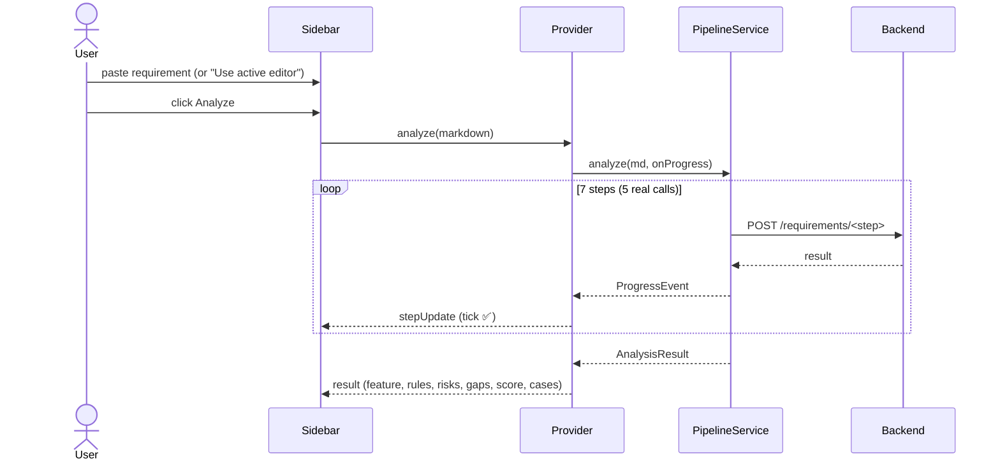
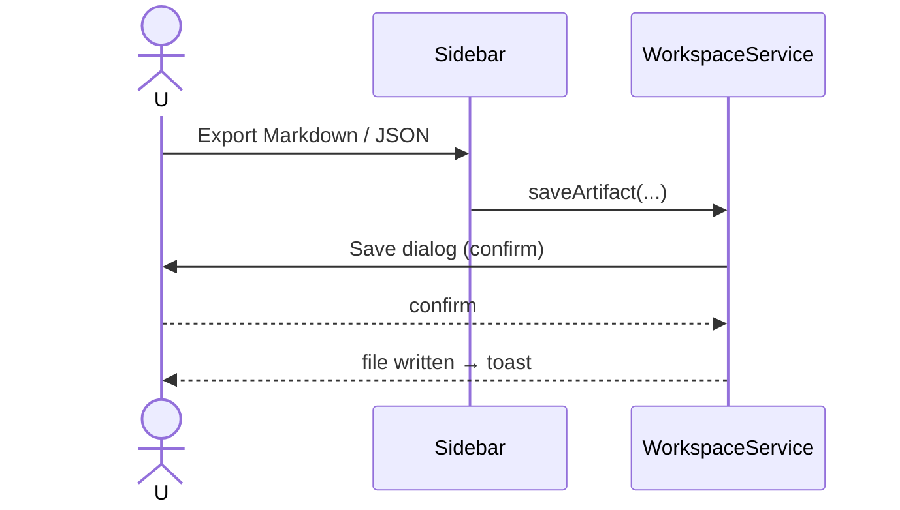
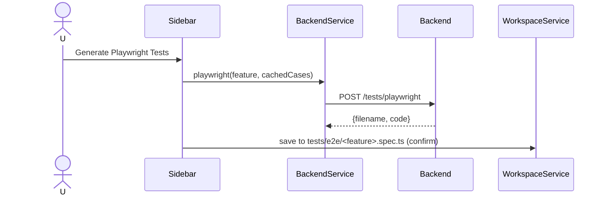

# User Flow

## Purpose
The end-to-end journeys a user takes through TestCasePilot, from requirement to
saved artifacts.

## Prerequisites
- Backend running: `uvicorn app.main:app --reload`.
- For the default Ollama provider: `ollama serve` + a pulled model (`llama3.1`).
- Status bar shows **connected** (click it to re-check).

## Primary flow — Analyze

> Timing note: a full run on a local 8B model takes ~2–3 min (`/generate` dominates) — the live ticks are what make the wait legible.

## Export flow

## Playwright flow

## Entry-point variants
- **CodeLens / right-click** on a `# requirement.md` → reveals the sidebar and runs Analyze.
- **Command Palette** → any action by name.
- **Auto-analyze** (opt-in): saving a requirement file triggers Analyze.
- **Form** ("New Requirement (Form)"): structured Feature/User story/Acceptance criteria → report.

## Responsibilities at each step
| Step | Owner |
|------|-------|
| Capture input | Sidebar webview / active editor |
| Orchestrate calls | PipelineService |
| Talk to backend | BackendService + ApiClient |
| Render live | Provider → webview messages |
| Persist | WorkspaceService (+ exporter) |

## Common Mistakes (user-facing)
- Backend/Ollama not running → "offline"; start them, then re-check status.
- `apiUrl` pointing at the wrong port → update the setting (takes effect live).
- Expecting instant results → the pipeline is genuinely multi-minute on local models.

## Best Practices
- Use **Use active editor** to avoid copy/paste.
- Export JSON for downstream automation, Markdown for human review.
- Treat Playwright output as a scaffold (`test.fixme()`), then fill in selectors.

## Future Improvements
- A "Stop" button (request cancellation).
- Progress via SSE so the wait is one streamed run, not five calls.
- Inline diff/insert of generated cases into an existing test file.

## Interview Talking Points
- The flow makes an opaque, minutes-long agent run observable step by step.
- Multiple entry points converge on one orchestration path.
- Every artifact-writing step is confirmation-gated.
