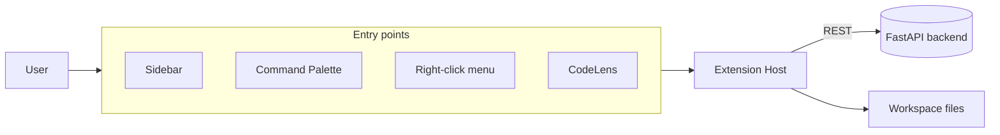

# VS Code Extension — Overview

## Purpose
The TestCasePilot extension lets a developer turn a software requirement into
review-ready QA test cases without leaving the editor. It is a thin TypeScript
client over the FastAPI backend.

## Architecture Diagram


## Responsibilities
- User interaction (sidebar, commands, menus, CodeLens).
- Reading the active editor / workspace files.
- Calling the backend over REST and displaying results.
- Writing generated artifacts (with confirmation).
- **Never** calling an LLM directly.

## Project layout
```
extension/
├─ esbuild.js              # build script
├─ media/sidebar.{css,js}  # webview assets (browser)
└─ src/
   ├─ extension.ts         # composition root
   ├─ config/ models/ api/ services/ providers/ views/ commands/ utils/
   └─ test/                # node --test unit tests
```

## Development
```bash
cd extension
npm install
npm run build        # esbuild → dist/extension.js   (npm run watch to rebuild)
npm run typecheck    # tsc --noEmit
npm test             # tsc → out/, then node --test out/test/*.test.js
```
Launch the Extension Development Host with **F5** (or
`code --extensionDevelopmentPath=extension`). The backend must be running
(`uvicorn app.main:app --reload`) and, for the default Ollama provider, `ollama serve`.

## Settings
| Key | Default | Effect |
|-----|---------|--------|
| `testcasePilot.apiUrl` | `http://127.0.0.1:8000` | Backend base URL (read live). |
| `testcasePilot.defaultProvider` | `auto` | Provider hint forwarded to the backend (seam; backend selects via env today). |
| `testcasePilot.autoAnalyze` | `false` | Analyze a requirement file on save. |
| `testcasePilot.enableLogs` | `true` | Write requests/errors/timings to the Output channel. |

## VS Code APIs used
Commands, WebviewView, CodeLens, StatusBar, OutputChannel, configuration,
workspace events, `workspace.fs`, notifications, Progress.

## Common Mistakes
- Forgetting to start the backend/Ollama → "offline" everywhere.
- Editing TypeScript but not rebuilding (`npm run watch`) before reloading.
- Expecting `defaultProvider` to switch providers today (it's a forward seam).

## Best Practices
- Keep the extension thin; push logic to the backend.
- Theme-token styling only (`var(--vscode-*)`) for automatic light/dark.

## Future Improvements
- Package + publish a `.vsix` (`@vscode/vsce`).
- Per-request provider selection once the backend honors it.

## Interview Talking Points
- The same action has four discoverable entry points routed to one handler.
- Settings are read fresh + reacted to live (no reload).
- Build/test split keeps a fast ship bundle and real type safety.
