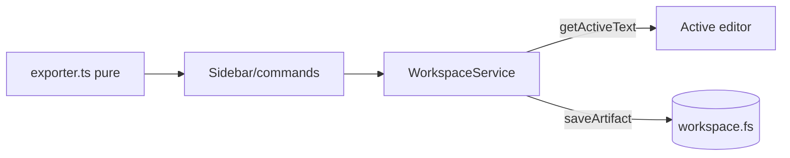
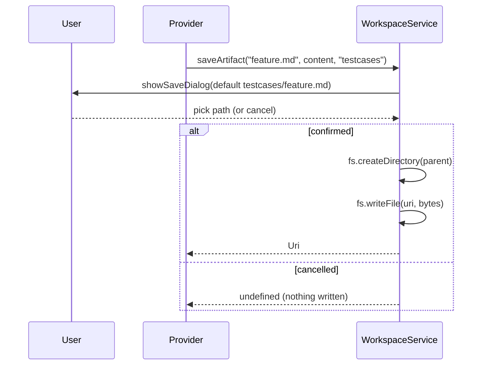

# Workspace API

## Purpose
How the extension reads editor content and writes generated artifacts to the
workspace — safely, never modifying files without confirmation.

## Architecture Diagram

## Responsibilities
- **`exporter.ts` (pure):** `AnalysisResult → {fileName, content}` for Markdown (reuses `render`) and JSON; `slugify` makes a safe filename stem. No `vscode`, fully tested.
- **`WorkspaceService` (effects):** the single owner of editor + filesystem access.
  - `getActiveText()` — selection or whole document; `undefined` if no editor.
  - `saveArtifact(fileName, content, subdir)` — Save dialog (confirms overwrite), creates the parent folder, writes via `workspace.fs`.

## Sequence Diagram — export

## Safety model
Every write goes through `showSaveDialog`, which **natively confirms overwrites**
and lets the user redirect the path. Cancel → nothing is written. This satisfies
"never modify files without confirmation" by construction. Defaults: Markdown/JSON
→ `testcases/<feature>.{md,json}`; Playwright → `tests/e2e/<feature>.spec.ts`.

## VS Code APIs used
`window.activeTextEditor`, `TextDocument.getText`, `Selection`,
`window.showSaveDialog`, `workspace.fs.createDirectory`, `workspace.fs.writeFile`,
`Uri.joinPath`, `workspace.asRelativePath`, `workspace.workspaceFolders`.

## Common Mistakes
- Using `node:fs` → breaks in remote/virtual/web workspaces. Use `workspace.fs`.
- Silent overwrite → data loss. Route through `showSaveDialog`.
- Not creating the parent dir → `writeFile` fails on a fresh folder.
- `Buffer` assumptions → `writeFile` wants `Uint8Array` (`TextEncoder`).

## Best Practices
- Functional core / imperative shell: pure `exporter` + thin `WorkspaceService`.
- One owner for all editor/filesystem access.
- Confirmation as part of the interaction, not an afterthought.

## Future Improvements
- "Open after save" and "reveal in explorer" follow-ups.
- Batch export of multiple artifacts.

## Interview Talking Points
- `workspace.fs` (not `node:fs`) is what makes the tool work over SSH/Codespaces/web.
- Pushing logic into pure builders shrinks the hard-to-test I/O surface to almost nothing.
- Safety guaranteed by the dialog, not by custom prompt code.
